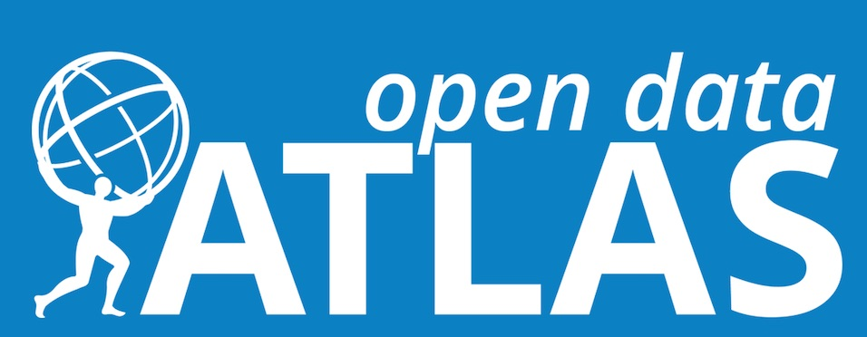

# Work In Progress
**Adding the VDI file of the VM-SL6 to the VirtualBox machine does not currently function properly.  We are working on it and it will be fixed soon.**

# ATLAS data & tools virtual machine documentation

You will learn how to download and prepare a virtual machine to run on your computer.  This will then enable you to take a look at ATLAS data.

## What is a virtual machine ?

A virtual machine will transform your computer into an analysis machine!

Your physical computer will be the "host", while the virtual machine will be a "guest". Most of the guest code runs unmodified, directly on the host computer, and the guest operating system "thinks" it's running on a real machine.

A virtual machine allows an unmodified operating system with all of its installed software to run in a special environment, on top of your existing operating system. 

