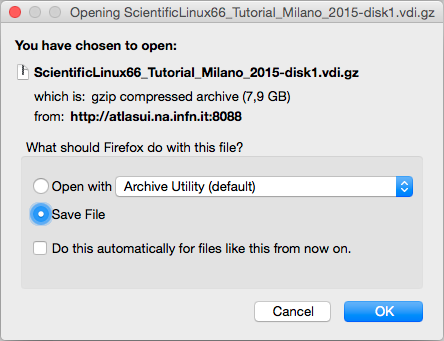
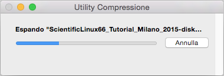

# Get and Run the Virtual Machine

## Getting the Virtual-Machine-Scientific-Linux-6.7 ( **VM-SL6.7** ) with the **ATLAS Data & Tools Software and Samples**

In order to obtain the **VDI** file of our **VM-SL6.7**, we need to be sure that our host system has space for that.  At least **30GB** of space should be reserved for this.

To download the compressed file just [[https://arturos.web.cern.ch/arturos/ATLAS/outreach/vm/OutReach/vm/ScientificLinux67_ATLAS_Outreach_Tutorial_CERN_2016-disk1.vdi.gz]
[click here]].

You can use the "[[https://arturos.web.cern.ch/arturos/ATLAS/outreach/vm/OutReach/vm/][window]]" below to get the **VM-SL6.7**

You can directly select the option of **Open** the file if you have it: 

Unzip the VM-SL6

Adding the **VDI** file of the **VM-SL6** to the VirtualBox machine: You must click **Settings** on the up-left position of your VirtualBox window (the " _gear_  " icon)

Now in the new _pop-up_ window, you must go to **Storage** ( _4th left to the right_ ) 

You will see on the right the **Hard Disk** and a small icon of a _hard disk_ where if you click there, the system will give you two options. You have to select: **Choose a virtual hard disk file...**

And browse for the recent downloaded (and uncompressed) **VDI** file of the **VM-SL6.7** :

Now say **OK** to the **Settings** window and **Start** your **VM-SL6.7**    ( _you will see something like this below_ )

**IMPORTANT NOTE:** To login the **VM-SL6** use as _username_ = **adminuser** and as _password_ = **adminuser**
(This is your *root* password if you plan/need to do ==su== and/or ==sudo== ).

