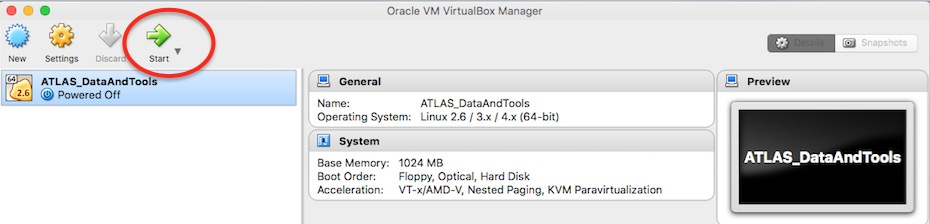

# Get and Run a virtual machine

Our virtual machines contain Scientific Linux 6.7 ( **VM-SL6.7** ) plus ATLAS Data and Tools software and samples.  This is bundled up in a VDI  (Virtual Desktop Infrastructure) file.
You need to have at least  **30GB** of space on your host machine.

Select the black 'Download' button at the top right of the page, then select 'Virtual Machines'.  

 

Or just directly select 'Virtual Machines'.

There are four versions of virtual machines.  Select the version appropriate to your needs.  **VM Version L is recommended, if you have the space**, as it contains all the software and datasets. 

## The virtual machines

**VM Version M** 

M for Medium, it has a compressed size of ~4.6GB, and a uncompressed size of ~11GB. This contains a complete Scientific Linux OS 6.7, important software dependencies and the latest version of ROOT v6-07-06

**VM Version L** 

L for Large, it has a compressed size of ~10.6GB, and a uncompressed size of ~22GB. This contains a complete Scientific Linux OS 6.7, important software dependencies, the latest version of ROOT v6-07-06 and the **complete set of datasets** (real and simulated data) of the ATLAS release.

**VM Version N**

N for NET, it has a compressed size of ~5.2GB, and a uncompressed size of ~17GB. This contains a complete Scientific Linux OS 6.7, important software dependencies and CVMFS access to public software repositories. We will reduce its size by ~40% in the coming weeks.

**VM Version $$\mu$$**

$$\mu$$ for micro with unknown sizes yet, but much smaller that VM-N or VM-S. It will contain a Linux distribution with not graphical user interface. It will have important software dependencies and the latest version of ROOT v6*

## Download your virtual machine

Select and download the virtual machine that suits you.  VM Version L is recommended, if you have the space, as it contains all the software and datasets.

**Download will take some time.  Please be patient.**

Your virtual machine will be downloaded as a vdi file.
The **VDI** file might be unzipped automatically.

ScientificLinux67\_ATLAS\_Outreach\_DataAndTools\_July\_2016-size\_[M/L/N/mu].vdi 

If not, you can select the option of opening the zipped file ( file ending .vdi.gz ) which will unzip it.

You have successfully got your virtual machine.

## Adding the VDI file to the VirtualBox machine: 

To run the virtual machine you need to add the VDI file to your VirtualBox machine (your empty virtual machine you created in the previous chapter)

Click **Settings**, the "gear" icon at the top-left of your VirtualBox window 

Now in the new pop-up window, go to **Storage** ( 4th option from the left) 

Select your .vdi

You will then see on the right **Hard Disk** and a small icon of a hard disk.  If you click on the hard disk icon, the system will give you options. 
Select: **Choose Virtual Hard Disk File...**

Browse for your recently downloaded (and uncompressed) **VDI** file of the **VM-SL6.7** :

Open.
Now say **OK** to the **Settings** window and start your **VM-SL6.7** by clicking on the green **Start** arrow.    

You will see something like this below

Now login to the **VM-SL6** 

with username = **adminuser** and password = **adminuser**

(This is your **root** password if you plan/need to do su and/or sudo ).

