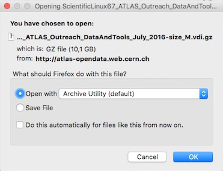

# Get and Run the Virtual Machine

## Getting the Virtual-Machine-Scientific-Linux-6.7 ( **VM-SL6.7** ) with the **ATLAS Data & Tools Software and Samples**

In order to obtain the Virtual Desktop Infrastructure (**VDI**) file of our **VM-SL6.7**, we need to be sure that our host system has space for it.  At least **30GB** of space should be reserved.

Select the black Download button at the top right of the webpage, then Virtual Machines.  

 

There are four versions of Virtual Machine (VM):  
* S: This contains all the software and files.  Size 31 GB     
* M: This is a lighter version with size 18.51 GB
* N: 
* mu:

Select the VM Version appropriate to your needs.  VM Version S is recommended, if you have the space, as it contains all the software and files.

Download may take some time.  Please be patient.

The **VDI** file of the **VM-SL6**
might be unzipped automatically.
ScientificLinux67_ATLAS_Outreach_DataAndTools_July_2016-disk[S/M/N/mu].vdi 

If not, you can directly select the option of opening the .vdi.gz file.

Which will unzip the file

## Addding the VDI file of the VM-SL6 to the VirtualBox machine: 

**Adding the VDI file of the VM-SL6 to the VirtualBox machine does not currently function properly.  We are working on it and it will be fixed soon.**

You must click **Settings** on the top-left position of your VirtualBox window (the " _gear_  " icon)

Now in the new _pop-up_ window, you must go to **Storage** ( _4th left to the right_ ) 

Select your .vdi
You will then see on the right the **Hard Disk** and a small icon of a _hard disk_ .If you click there, the system will give you two options. 
You have to select: **Choose a virtual hard disk file...**

Browse for the recent downloaded (and uncompressed) **VDI** file of the **VM-SL6.7** :

Now say **OK** to the **Settings** window and **Start** your **VM-SL6.7**    ( _you will see something like this below_ )

**IMPORTANT NOTE:** To login to the **VM-SL6** use as _username_ = **adminuser** and as _password_ = **adminuser**
(This is your *root* password if you plan/need to do su and/or sudo ).

