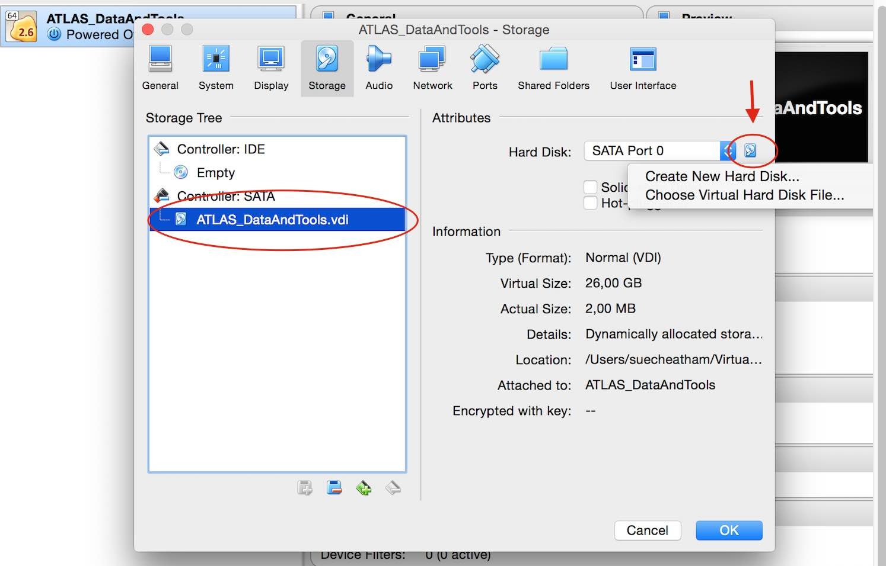
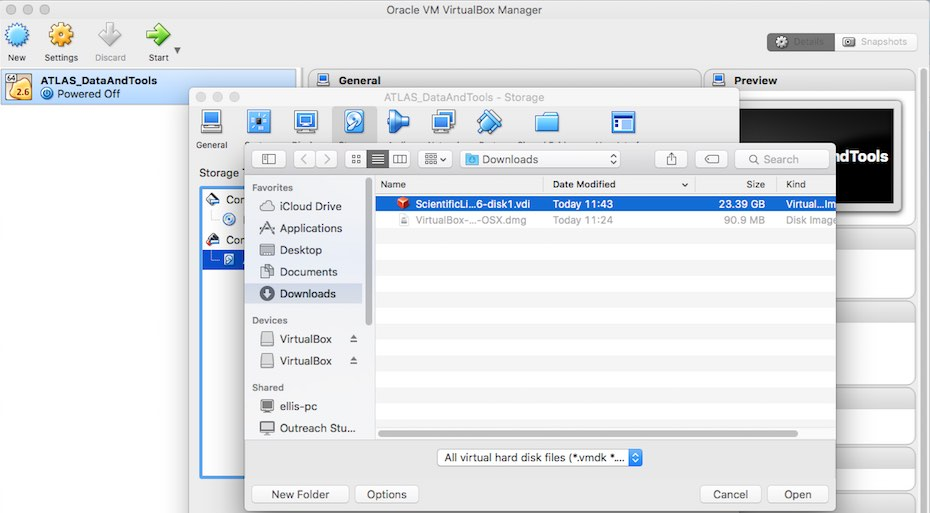

# Get and Run the Virtual Machine

## Getting the Virtual-Machine-Scientific-Linux-6.7 ( **VM-SL6.7** ) with the **ATLAS Data & Tools Software and Samples**

In order to obtain the Virtual Desktop Infrastructure (**VDI**) file of our **VM-SL6.7**, we need to be sure that our host system has space for it.  At least **30GB** of space should be reserved.

Select the black 'Download' button at the top right of the page, then select 'Virtual Machines'.  

 

Or just directly select Virtual Machines.

There are four versions of Virtual Machine (VM):  
**VM-S** 
: S for “small”, it has a compressed size of ~4.6GB, and a uncompressed size of ~11GB. This contains a complete Scientific Linux OS 6.7, important software dependencies and the latest version of ROOT v6-07-06

**VM-M** 
: M for “medium”, it has a compressed size of ~10.6GB, and a uncompressed size of ~22GB. This contains a complete Scientific Linux OS 6.7, important software dependencies, the latest version of ROOT v6-07-06 and the **complete set of datasets** (data and simulated Monte Carlo) of the ATLAS release.

**VM-N**
: N for “NET”, it has a compressed size of ~5.2GB, and a uncompressed size of ~17GB. This contains a complete Scientific Linux OS 6.7, important software dependencies and CVMFS access to public software repositories. We will reduce its size by ~40% in the coming weeks.

**VM-mu**
: mu for “micro” with unknown sizes yet, but much smaller that VM-N or VM-S. It will contain a Linux distribution with not graphical user interface. It will have important software dependencies and the latest version of ROOT v6*

Select the VM Version appropriate to your needs.  **VM Version M is recommended, if you have the space**, as it contains all the software and datasets.

**Download will take some time.  Please be patient.**

The **VDI** file of the **VM-SL6**
might be unzipped automatically.

ScientificLinux67\_ATLAS\_Outreach\_DataAndTools\_July\_2016-size\_[S/M/N/mu].vdi 

If not, you can select the option of opening the .vdi.gz file, which will unzip the file.

You have successfully got your Virtual Machine.
vdi stands for virtual desktop infrastructure.

## Addding the VDI file of the VM-SL6 to the VirtualBox machine: 

Click **Settings**, the " _gear_  " icon at the top-left of your VirtualBox window 

Now in the new pop-up window, go to **Storage** ( 4th option from the left) 

Select your .vdi

You will then see on the right **Hard Disk** and a small icon of a hard disk.  If you click there, the system will give you two options. 
Select: **Choose a virtual hard disk file...**

Browse for the recently downloaded (and uncompressed) **VDI** file of the **VM-SL6.7** :

Open.
Now say **OK** to the **Settings** window and **Start** your **VM-SL6.7**   

You will see something like this below

Now login to the **VM-SL6** 

with username = **adminuser** and password = **adminuser**

(This is your **root** password if you plan/need to do su and/or sudo ).

