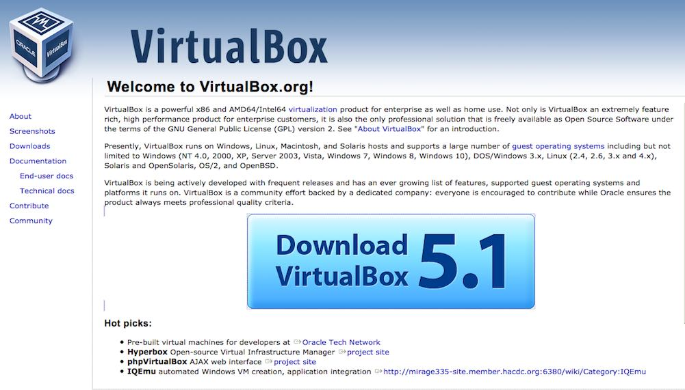
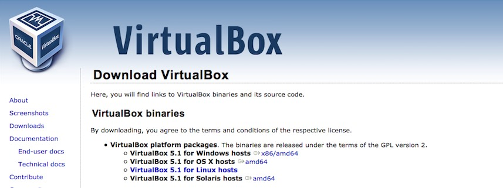
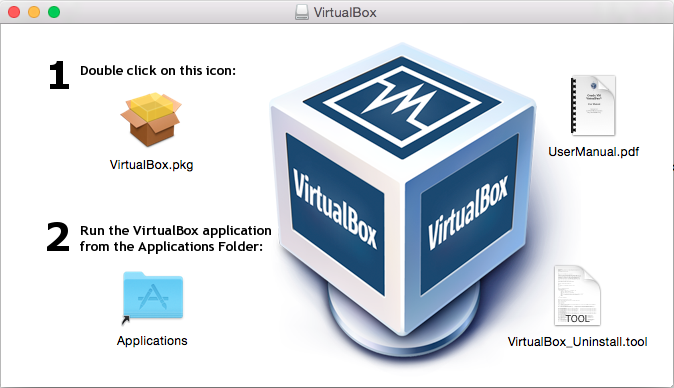
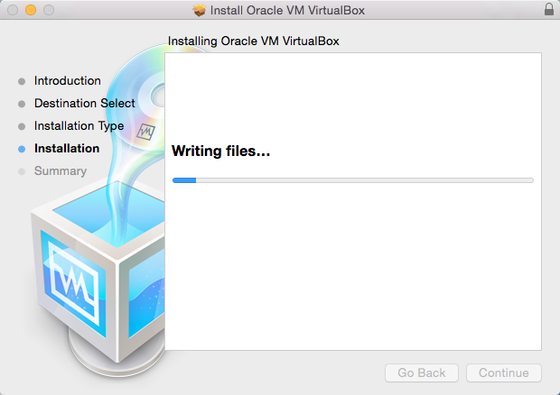
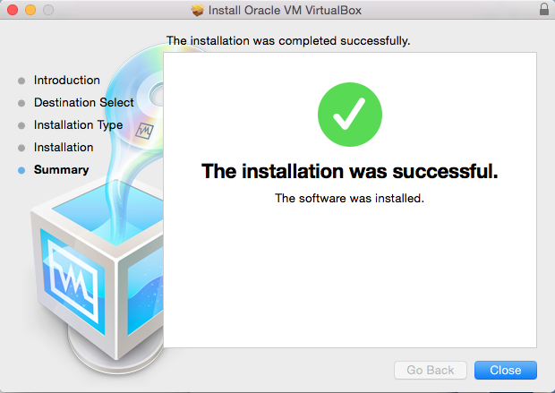

# Get the VirtualBox

# Getting the Virtualization Software (Hypervisor) VirtualBox

Use the VirtualBox website to download the software

<a href="https://www.virtualbox.org/" target="_blank"> Go to the VirtualBox website</a>

## Step by step 

Select **Download VirtualBox**
 
 

Take care to select the appropriate **VirtualBox platform package**.

 
  

Proceed with the installation of VirtualBox:

