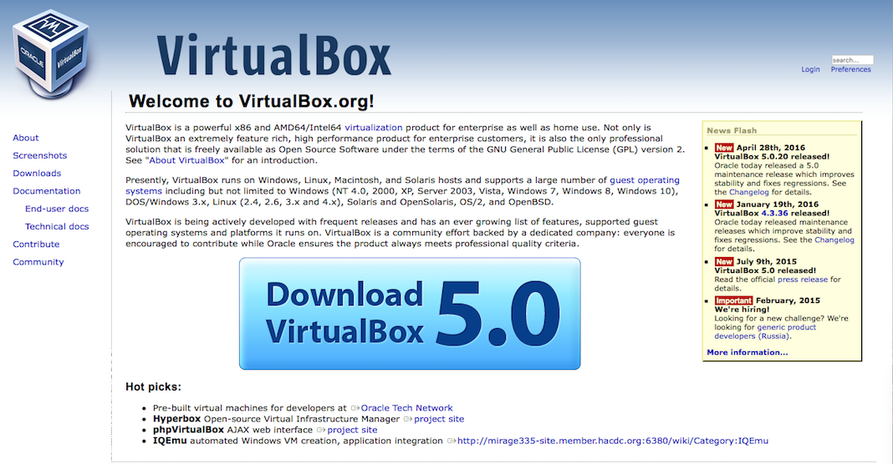
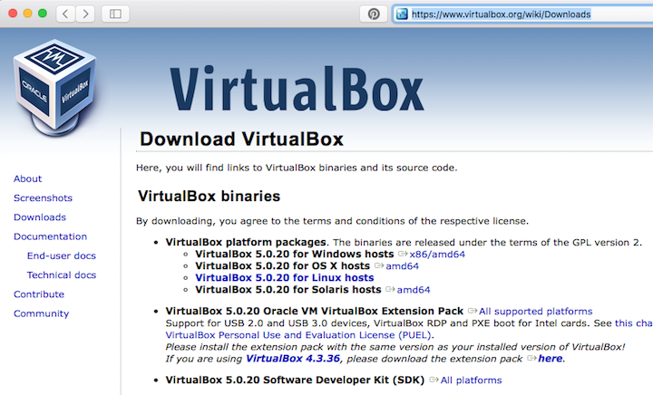

# Get the VirtualBox

# Getting the Virtualization Software (Hypervisor) VirtualBox

Use the website [VirtualBox](https://www.virtualbox.org/) to *download the software*.  

sue

<a href="https://www.virtualbox.org/" target="_blank"> Go to the VirtualBox website!</a>

## Step by step 

Select **Download VirtualBox**
  
  
  Take care to select the appropriate **VirtualBox platform package**.

Proceed with the installation of VirtualBox:

