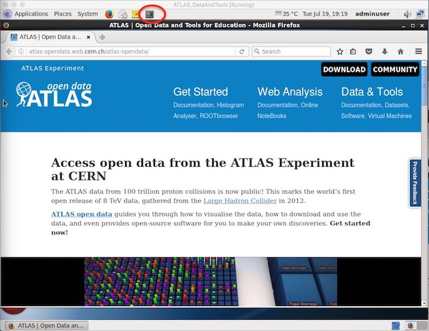
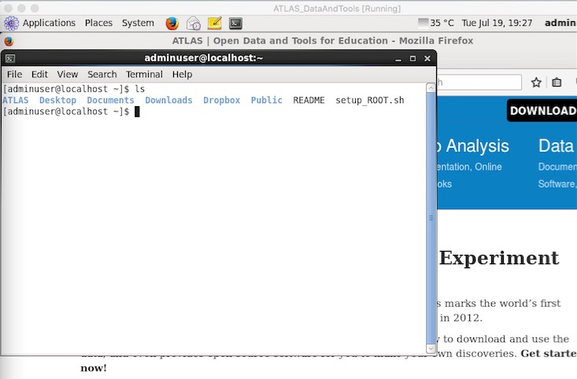
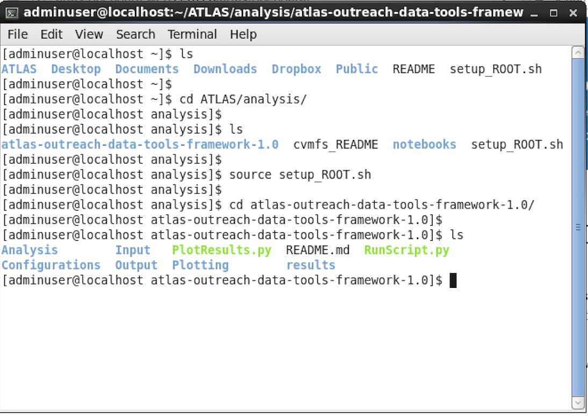
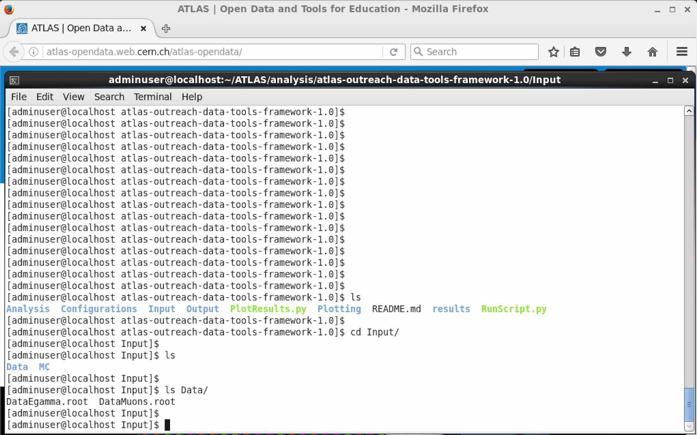
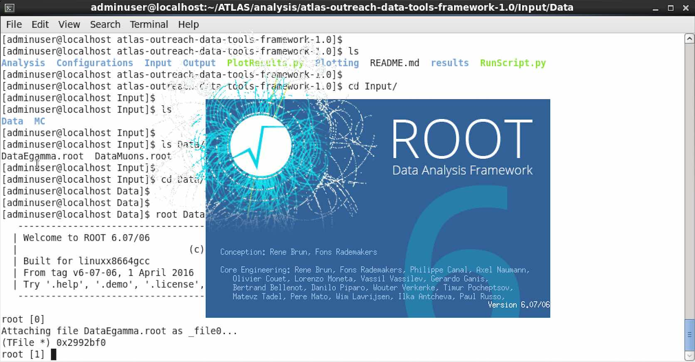
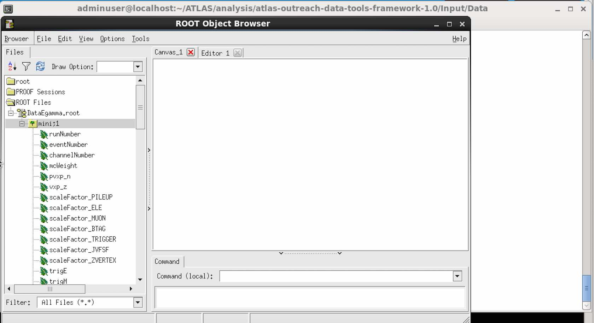
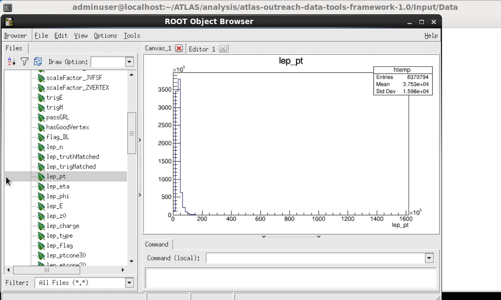
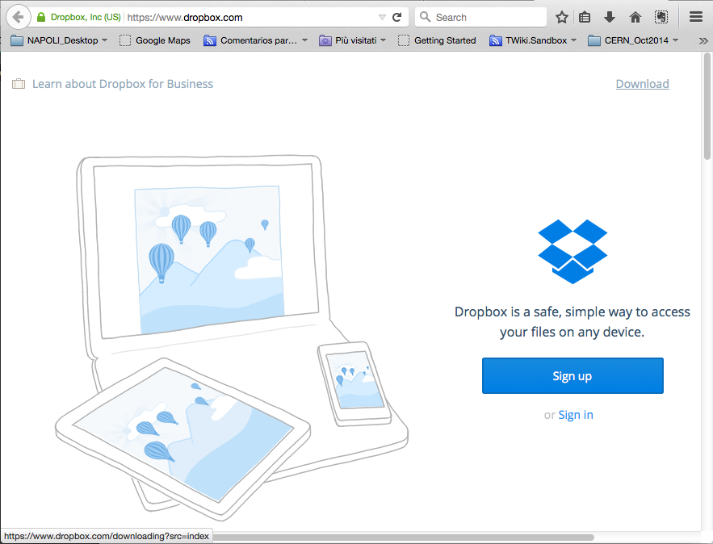
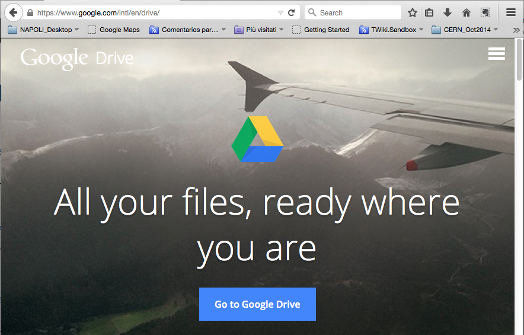

# Inside the Virtual Machine

You will get this presentation below, where the **only bookmark** is the tutorial that you are doing now!



Open a new **Terminal** \( the icon is at the top, shown here circled in red\) and type **ls**.

You will get the list of files: ATLAS, Desktop, Documents, Downloads, Dropbox, Public, README and setup\_ROOT.sh



Go into the ATLAS/analysis folder

`cd ATLAS/analysis`

Run the setupROOT script.

`source setup\_ROOT.sh`

Go into the atlas-outreach-data-tools-framework-1.0 folder

`cd atlas-outreach-data-tools-framework-1.0`

and list the files in the directory

```
ls
```

Here you will see Analysis, Configurations, Input, Output, Plotting and results folders plus two python scripts and README.md



## Take a look at the datasets.

Data and simulated data root ntuples are in the Input folder.



Take a look

`cd Input`

`ls Data`

You will see there are two datasets in the Data directory, DataEgamma.root and DataMuons.root

Now let's take a closer look at ome of these.  
Launch root, attaching your chosen dataset

```
root Data/DataEgamma.root
```



Use Tbrowser to look at the different variables available.



Then plot the variables.



Take a look at some of the other variables.  See if you can understand the shape of the distributions.  
When you want to finish looking at the dataset, quit root

`- q`

## Cloud client

You can install a Cloud client to keep a real time contact with your two machines.

Use Dropbox \(included\) or Google Drive Client to share files between your VM and your host OS:

  
    

## Now you are ready to start your analysis of the data.

Go to the [Software Book](https://cheatham1.gitbooks.io/openatlasdatatools/content/take_a_look_at_the_data.html) to learn how to run and produce plots.

