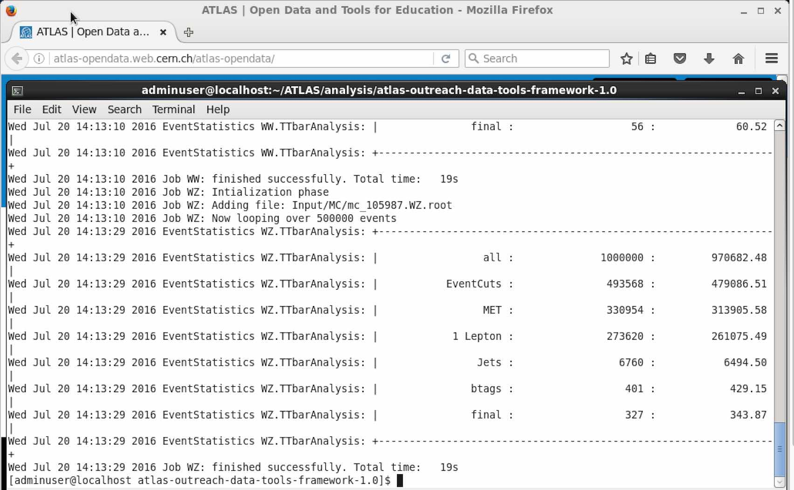

# Inside The Virtual Machine

You will get this presentation below, where the **only bookmark** is the tutorial that you are doing now! 


Open a new **Terminal** ( the icon is at the top, shown here circled in red) and do a **ls**  command right there. You will get the list: ATLAS, Desktop, Documents, Downloads, Dropbox, Public, README and setup_ROOT.sh


Go into the ATLAS/analysis folder.  

```cd ATLAS/analysis```

Run the setupROOT script.  

```source setupROOT.sh```

Go into the atlas-outreach-data-tools-framework-1.0 folder.

```cd atlas-outreach-data-tools-framework-1.0```

Here you will see : Analysis, Configurations, Input, Output, Plotting and results folders plus two python scripts and README.md 


## Take a look at the datasets.

Data and simulated data root ntuples are in the Input folder.


Take a look:

```cd Input```

```ls Data```


Launch root, attaching your chosen dataset

    root Data/DataEgamma.root


Use Tbrowser to look at the different variables available.


Then plot the variables.


To quit root

```- q```

**Note:** You can install a Cloud client to keep a real time contact with your two machines.

   Use Dropbox (included) or Google Drive Client to share files between the VM-SL6 and your host OS:
    
 
    
    
   


## Now you are ready to start your analysis of the data.

Go to the chapter "**take a look at the data**" in the **Software Book**
and follow the instructions, starting with 

    python RunScript.py -a TTbarAnalysis -s "WW, WZ"
                



