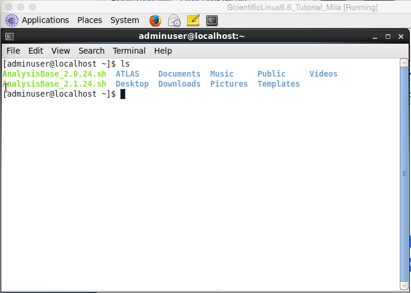
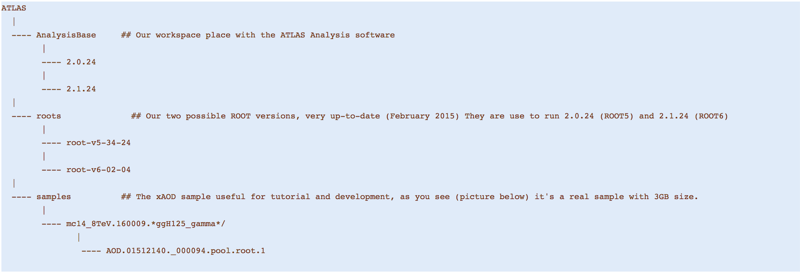

# Inside The Virtual Machine

## Software Available

If you open a Firefox window, you will get this presentation below, but where the **only bookmark** is the tutorial that you are doing now! 

Open a new **Terminal** ( _the icon is at the top..._ ) and do a **ls**  command right there, you will get the list:  (_picture below_)

I. The two scripts to setup the
  **AnalysisBase 2.0.24** and **AnalysisBase 2.1.24**;  
   AnalysisBase 2.0.24.sh and AnalysisBase 2.1.24.sh
   
   
II. The ATLAS folder containing the **software** and **xAOD input** we will use

III. Other Standard Linux folders

Going into the ATLAS folder you will find the structure:

                

You can see the behavior of **ROOT** using the two versions (ROOT5 and ROOT6 here below)

Taking a look into the two AnalysisBase setup scripts mentioned before (using command more ) you can see how **ROOT** is sourced and RootCore (+ _boost_ that is necessary to compile...) 

An internal view of one of the **AnalysisBase** releases: 

At this point you can start to work with the instructions in the Tutorial (_copying and pasting instructions..._) 

You can take a look at the **xAOD** file too, as mentioned in the tutorial, but browsing the file locally!

**Note:** You can install a Cloud client to keep a real time contact with your two machines.

 
   Dropbox or Google Drive Client to share files between the VM-SL6 and your host OS:
    
 
    
    
   

