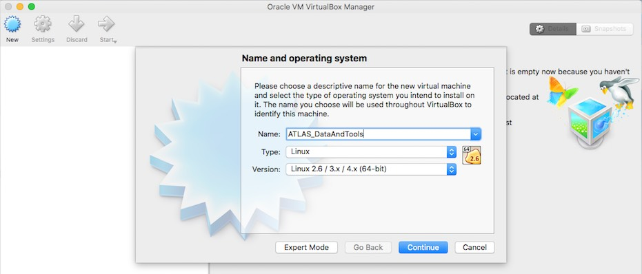
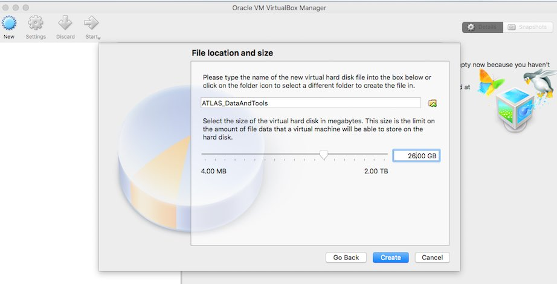
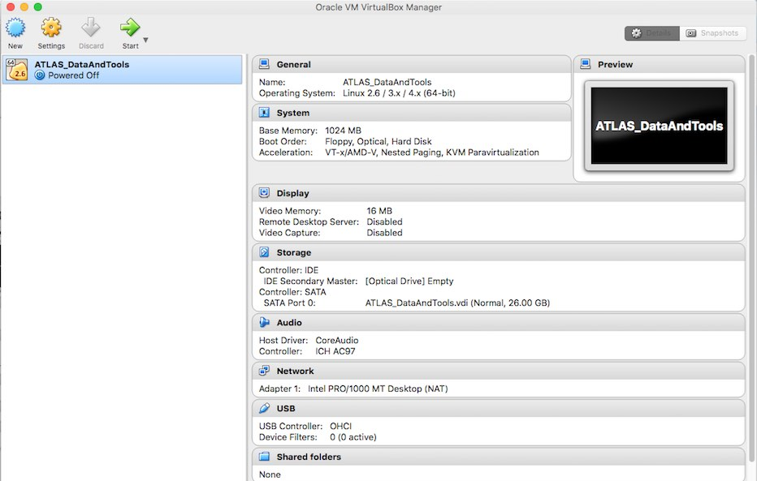

# Prepare the VirtualBox

## Create a Shell for the virtual machine (VM)

Look for the VirtualBox icon in your Applications (folder).  Double click to get the main interface of VirtualBox:

  
   
Now let's create a new virtual machine entity by clicking **New** on the left corner:

   

   
Select Type "Linux" (irrelevant of what type of machine you are running on) and Version "Linux 2.6/ 3.x / 4.x (64-bit)" from the drop-down menus.  Then "Continue".

For **Memory Size** I strongly suggest you to use **1024MB** of **RAM**

For the **Hard Drive** creation, take the middle option: " **Create a virtual hard drive now**"

For **Hard drive file type** take the default option " **VDI**"

For **Storage on physical hard drive** select " **Dynamically allocated** " (This is an _smart_ option for developing)

For **File location and size** you will need to select a maximum size from the virtual HD of **at least 26GB (or 30GB)** 

After those steps, your **virtual machine** is created (an empty virtual machine)

and should look like this:

