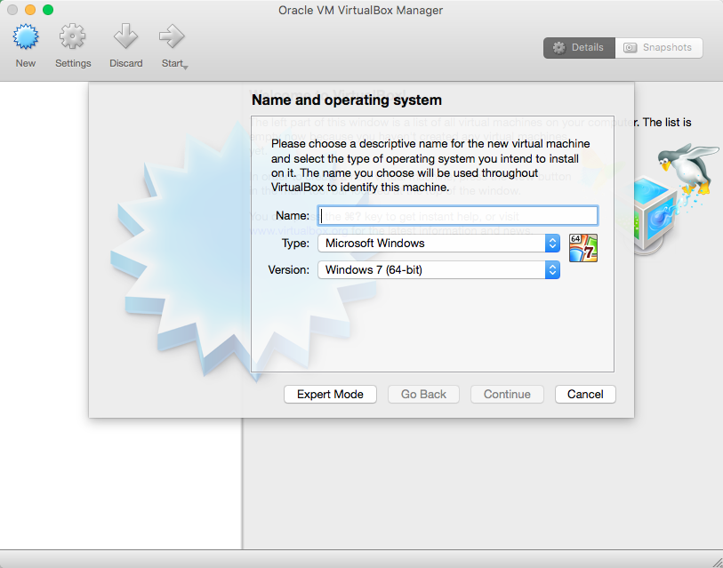
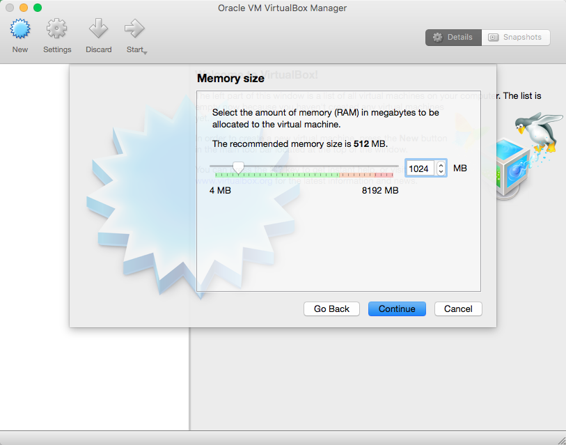
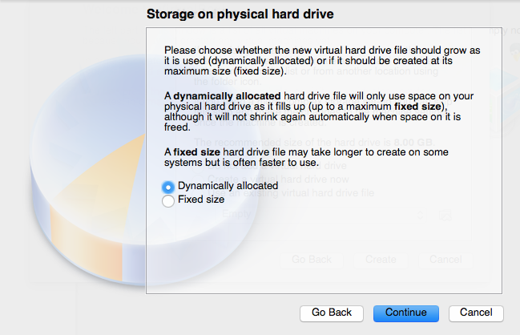

#VirtualBox

# 

**Some Steps:**

   ** Download the VirtualBox Program:**
   

     </verbatim>
     </verbatim> 
   

   * Proceed with the installation of VirtualBox:
   

     </verbatim>  
     </verbatim>  
     </verbatim>  
   

   * Look for the icon into your Applications (folder) and get the main interface of VirtualBox:
   

     </verbatim> 
   

## Create a Shell for the Virtual Machine (VM)

Now let's create a new VM entity by clicking *New* on the left corner:
   

   

For **Memory Size** I strongly suggest you to use **1024MB** of **RAM**

For the **Hard Drive* creation, take the middle's option: " *Create a virtual hard drive now**

For **Hard drive file type** take the default option " **VDI**

For **Storage on physical hard drive** select " **Dynamically allocated** " (This is an _smart_ option for developing)

For **File location and size** you will need to select a maximum size fro the virtual HD of **at least 26GB (or 30GB)** 

After those steps, your **VM** is created (well, an empty VM)

Good VM-SL6 Configuration

